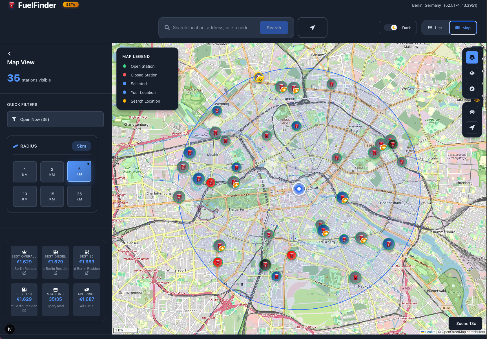
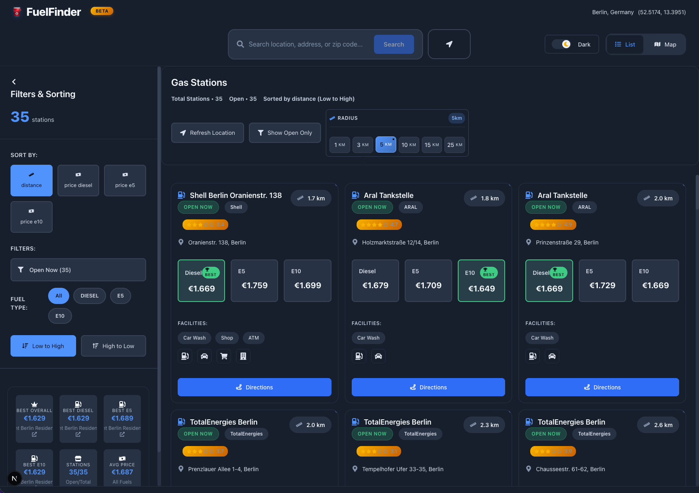

# FuelFinder ⛽
A modern web application for discovering nearby gas stations, comparing fuel prices, and viewing detailed maps and lists. Built with Next.js and React, featuring real-time location-based searches and interactive visualizations.

## 🚀 Features

- **🗺️ Interactive Map View** – Real-time station visualization using Leaflet
- **📋 Multiple Layout Options** – Map, list, table, and detailed card views
- **🔍 Smart Filtering** – Filter by fuel type (diesel, E5, E10), open status, and distance
- **💸 Price Comparison** – Visual price gradients and cheapest station highlighting
- **📍 User Location** – GPS integration with radius-based search
- **🌙 Dark Mode** – Toggle between light and dark themes
- **🏪 Station Details** – Comprehensive info including amenities, ratings, and services
- **🧭 Direction Integration** – One-click navigation via Google Maps
- **📱 Responsive Design** – Works seamlessly on desktop and mobile

## 🛠️ Tech Stack

- **React 18** with TypeScript
- **Leaflet / React-Leaflet** for interactive maps
- **Custom Hooks** for state management and data processing
- **Local Storage** for persistent user preferences
- **CSS Modules** for component styling
- **Tankerkönig API** for real-time fuel price data

## 🗂️ Project Structure
```
app/
├── 📁 components/
│   ├── layouts/                    # Layout components
│   ├── ui/                         # UI components
│   ├── ClickableStats.tsx          # Interactive statistics display
│   ├── DarkModeToggle.tsx          # Dark/light mode toggle
│   ├── EnhancedSearch.tsx          # Advanced search functionality
│   ├── ListViewSidebar.tsx         # Sidebar for list view
│   ├── MapControls.tsx             # Map control buttons
│   ├── MapViewSidebar.tsx          # Sidebar for map view
│   ├── RecentSearches.tsx          # Recent search history
│   ├── StationCard.tsx             # Station card component
│   └── index.ts                    # Component exports
│
├── 📁 hooks/
│   ├── useDarkMode.ts              # Dark mode state management
│   ├── useDataProcessing.ts        # Data processing and filtering
│   ├── useGasStation.ts            # Gas station data handling
│   ├── useLocation.ts              # Geolocation functionality
│   └── usePersistentState.ts       # Local storage persistence
│
├── 📁 services/
│   └── gasStationService.ts        # API service for fuel data
│
├── 📁 types/
│   └── gasStationTypes.ts          # TypeScript type definitions
│
├── 📁 utils/
│   ├── apiErrorHandler.ts          # API error handling utilities
│   ├── distanceCalculator.ts       # Distance calculation utilities
│   ├── formatUtils.ts              # Price and data formatting
│   └── gasStationUtils.ts          # Station data utilities
│
├── 📄 DetailedListView.tsx         # Detailed list view component
├── 📄 DetailedMapView.tsx          # Interactive map component
├── 📄 GasStationsList.tsx          # Main container component
├── 📄 GasStationsList.css          # Main stylesheet
├── 📄 MapView.tsx                  # Map view wrapper
├── 📄 globals.css                  # Global CSS styles
├── 📄 layout.tsx                   # Root layout component
├── 📄 page.tsx                     # Main application page
└── 📄 *test.tsx                    # Test files (comprehensive test suite)
```

## 🚦 Getting Started

### Prerequisites
- Node.js 16+ and npm/yarn
- Tankerkönig API key (for German fuel price data)

### Installation

1. Clone the repository
   ```bash
   git clone https://github.com/yourusername/fuel-finder.git
   cd fuel-finder
   ```

2. Install dependencies
   ```bash
   npm install
   ```

3. Set up environment variables
   Create a `.env.local` file:
   ```env
   NEXT_PUBLIC_TANKERKOENIG_API_KEY=your_api_key_here
   ```

4. Start the development server
   ```bash
   npm run dev
   ```

5. Open [http://localhost:3000](http://localhost:3000) in your browser

## 📖 Usage

### 🗺️ Map View
- Pan and zoom the interactive map
- Click stations for popup details
- Toggle price visualization circles
- Enable clustering for dense areas
- Use custom controls for recentering and filtering

### 📋 List View
- Choose between compact, detailed, or table layouts
- Sort by price, distance, or rating
- Expand station cards for full details
- Mark favorites for quick access

### 🔧 Features
- **Search Radius** – Adjust from 1km to 50km
- **Fuel Type Filter** – Show only specific fuel types
- **Open Now Filter** – Display only currently open stations
- **Best Price Highlights** – Quickly identify cheapest options
- **Directions** – Open navigation in Google Maps

## 📸 Application Screenshots

### 🌍 **Map View - Default Interface**

*Interactive map showing gas stations with custom markers, user location, and price heatmap visualization*

### 📊 **List View Layouts**

*Sortable table format with price comparisons and percentage differences*

## 🔑 Key Components

- **`DetailedMapView.tsx`** – Advanced map with markers, clusters, and price visualization
- **`GasStationsList.tsx`** – Main component coordinating views and filters
- **`DetailedListView.tsx`** – Flexible list with multiple layout options
- **`page.tsx`** – Application entry point with data fetching logic

## 📊 Data Source

Fuel price data is fetched from the [Tankerkönig API](https://creativecommons.tankerkoenig.de/) – Germany's official fuel price database with real-time updates.

## 🤝 Contributing

1. Fork the repository
2. Create a feature branch (`git checkout -b feature/amazing-feature`)
3. Commit your changes (`git commit -m 'Add amazing feature'`)
4. Push to the branch (`git push origin feature/amazing-feature`)
5. Open a Pull Request

## 📝 License

This project is licensed under the MIT License - see the [LICENSE](LICENSE) file for details.

## 🙏 Acknowledgments

- [Tankerkönig](https://tankerkoenig.de/) for providing the fuel price API
- [Leaflet](https://leafletjs.com/) for the mapping library
- [OpenStreetMap](https://www.openstreetmap.org/) for map tiles

---

Made with ⛽ by Usman Ghani Amin
